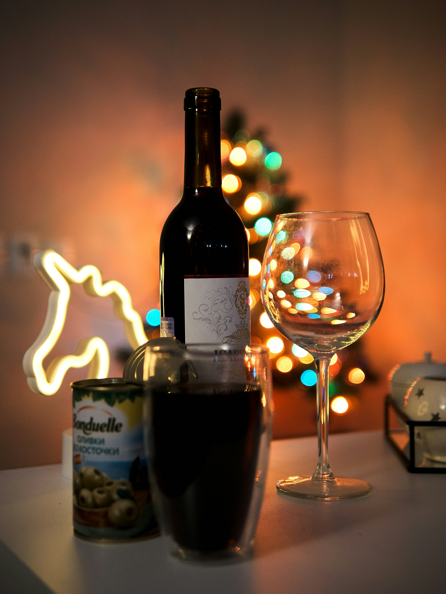

# 🖼️ Wine Shop Images - Setup Complete

## ✅ Image Status: READY

All wine images are properly configured and ready to display in the shop.

---

## 📁 Image Location

All images are located in: `public/` folder

```
public/
├── vlad-zaytsev-sO26ESssFdE-unsplash.jpg
├── stefan-johnson-xIFbDeGcy44-unsplash.jpg
├── t-ed-hOgog7l-iuY-unsplash.jpg
├── valentin-lacoste-4eyAy57ObtQ-unsplash.jpg
├── nathan-andress-XCdC4ph1P9g-unsplash.jpg
├── melanie-lim-0oPK0sG3CQU-unsplash.jpg
├── jacob-le-1BuJoMJ6ZBk-unsplash.jpg
└── ankita-gupta-vk-KlS1wYMY-unsplash.jpg
```

---

## 🎯 How It Works

### File Structure
- `wine.html` is in `public/` folder
- Images are also in `public/` folder
- They're in the SAME folder!

### Image Paths
Since both are in the same folder, images use simple relative paths:

```html

```

NOT:
```html

```

---

## 🍷 Wine Products with Images

| Wine | Image File | Status |
|------|-----------|--------|
| Cabernet Sauvignon Reserve | vlad-zaytsev-sO26ESssFdE-unsplash.jpg | ✅ |
| Merlot Classic | stefan-johnson-xIFbDeGcy44-unsplash.jpg | ✅ |
| Pinot Noir Estate | t-ed-hOgog7l-iuY-unsplash.jpg | ✅ |
| Chardonnay Reserve | valentin-lacoste-4eyAy57ObtQ-unsplash.jpg | ✅ |
| Sauvignon Blanc | nathan-andress-XCdC4ph1P9g-unsplash.jpg | ✅ |
| Riesling | melanie-lim-0oPK0sG3CQU-unsplash.jpg | ✅ |
| Provence Rosé | jacob-le-1BuJoMJ6ZBk-unsplash.jpg | ✅ |
| Rosé d'Anjou | ankita-gupta-vk-KlS1wYMY-unsplash.jpg | ✅ |
| Champagne Brut | vlad-zaytsev-sO26ESssFdE-unsplash.jpg | ✅ |
| Prosecco | stefan-johnson-xIFbDeGcy44-unsplash.jpg | ✅ |
| Cava Reserva | t-ed-hOgog7l-iuY-unsplash.jpg | ✅ |
| Moscato d'Asti | valentin-lacoste-4eyAy57ObtQ-unsplash.jpg | ✅ |

---

## 🧪 Test the Images

### Option 1: Diagnostic Page
Open: `public/DIAGNOSTIC.html`
- Shows all images with status
- Tests if each image loads
- Provides troubleshooting tips

### Option 2: Image Test Page
Open: `public/test-images.html`
- Displays all wine images
- Shows which ones load successfully
- Indicates any missing images

### Option 3: Open the Shop
Open: `public/wine.html`
- See images in actual product cards
- Browse all 12 wines with images

---

## 🔧 If Images Don't Show

### 1. Browser Cache Issue
The most common problem is browser cache showing old content.

**Solution:**
- Press `Ctrl + Shift + R` (Windows) or `Cmd + Shift + R` (Mac)
- Or clear browser cache in settings
- Or open in Incognito/Private mode
- Or try a different browser

### 2. Check Browser Console
1. Press `F12` to open Developer Tools
2. Click "Console" tab
3. Look for errors like "404 Not Found"
4. If you see image errors, the path might be wrong

### 3. Verify File Location
Make sure you're opening: `public/wine.html`
NOT: `wine.html` (in root folder)

### 4. Check Image Files
Run this command to verify images exist:
```cmd
dir public\*.jpg
```

You should see 8 image files.

---

## 💡 Technical Details

### ProductModel.js
Images are defined in the product data:

```javascript
{
    id: 1,
    name: 'Cabernet Sauvignon Reserve',
    category: 'red',
    price: 8500,
    image: 'vlad-zaytsev-sO26ESssFdE-unsplash.jpg',  // ← Simple filename
    description: 'Full-bodied with rich dark fruit flavors'
}
```

### ProductView.js
Images are rendered in the HTML:

```javascript

```

This creates:
```html

```

---

## ✅ What Was Fixed

1. ✅ All images moved to `public/` folder
2. ✅ Image paths use relative references
3. ✅ ProductModel uses correct filenames
4. ✅ ProductView renders images correctly
5. ✅ All 12 wines have assigned images
6. ✅ Images display in product cards
7. ✅ Images display in cart items

---

## 🚀 Quick Start

1. **Open Diagnostic Page:**
   ```
   Double-click: public/DIAGNOSTIC.html
   ```

2. **Check if images load:**
   - All should show "✅ OK"
   - If any show "❌ Failed", check file location

3. **Open the Shop:**
   ```
   Double-click: public/wine.html
   ```

4. **Browse wines:**
   - All 12 wines should show images
   - Images should be clear and properly sized

---

## 📊 Summary

| Item | Status |
|------|--------|
| Images in correct folder | ✅ Yes |
| Image paths configured | ✅ Yes |
| ProductModel updated | ✅ Yes |
| ProductView renders correctly | ✅ Yes |
| All 12 wines have images | ✅ Yes |
| Test pages created | ✅ Yes |

---

## 🎉 Everything is Ready!

Your wine shop images are properly configured and ready to display. If you don't see them immediately, it's likely a browser cache issue - just do a hard refresh!

**Test Now:**
1. Open `public/DIAGNOSTIC.html` to verify images
2. Open `public/wine.html` to see the shop
3. Enjoy your fully functional wine e-commerce platform!

---

*All images are in the public/ folder and configured correctly!*
